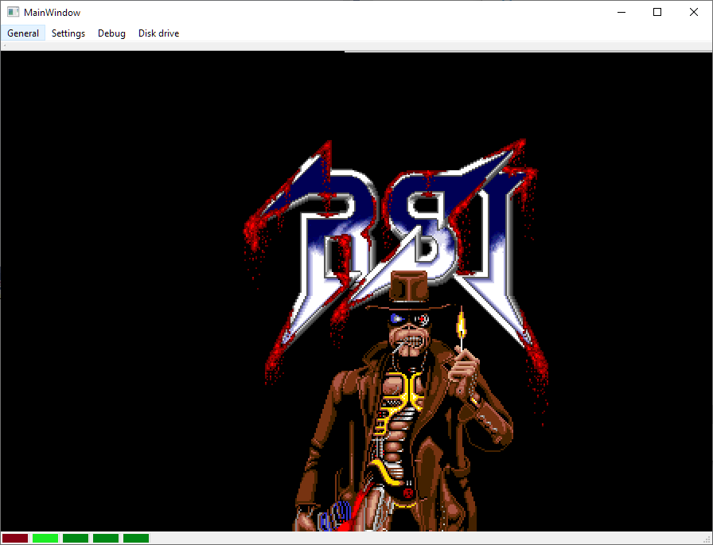

# AmigaEmu

This is an Amiga 500 emulator.

It's main goal is to be a *hobby* project : If you are looking for a precise / complete Amiga emulator, it's not the right place to be !

Also, I plan to write everything from scratch : No use of existing emulator or code. This is to be sure to understand how everything is working. 

What's currently included : 
- Most 68000 insctructions, more or less precise, more or less complete.
- Blitter functions (except filling operation)
- Copper
- Disk support (only ADF files)
- Bitplanes
- CIA8520
- DMA (disk, bitplanes, blitter)
- Hack to display some sprites
- Some debug tools (stop/step, memory display, bitmaps, disk status..)

What's missing
- Some 68000 instructions. Timings
- Complete Sprite display 
- Sound
- Mouse and keyboard
- IPF, DMS, HFE, and other disk formats
- Enhanced debug tools
- ... and lots of other stuff !

# How to build 

*To be completed.*

Use CMake to make it build.
I use Visual Studio 2022 & 2017. Need Qt (in version 5.11 at least, I suppose). 

# How to run

Launch it. Open "Debug" menu, start "run" on the debug window.
Drag'n'drop files.
Beware, lots of stuff is not working (like the reset). It's actually better to stop and restart the emulator at the moment.

# Screenshots of current version

